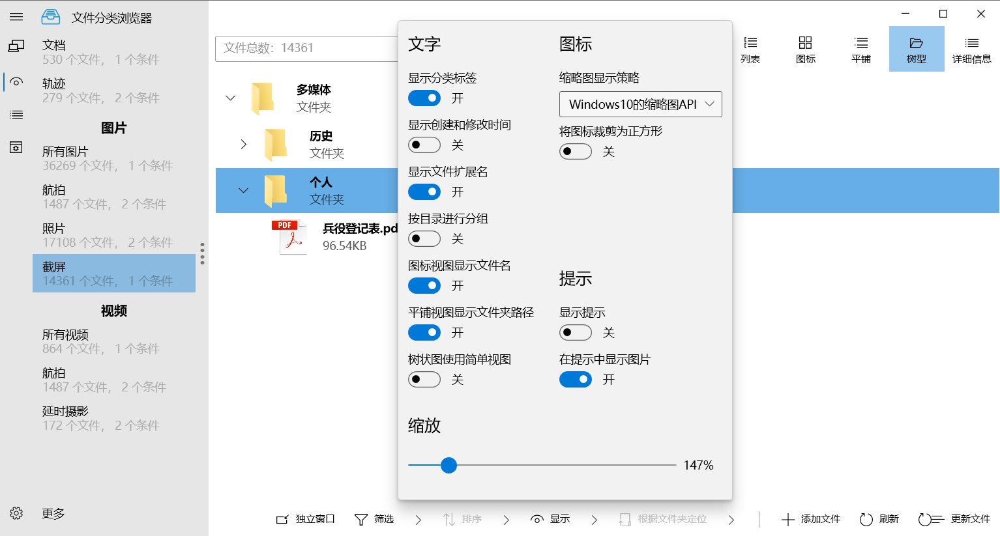
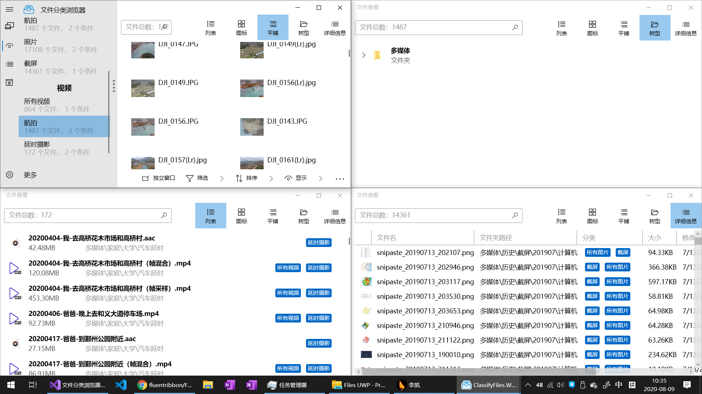
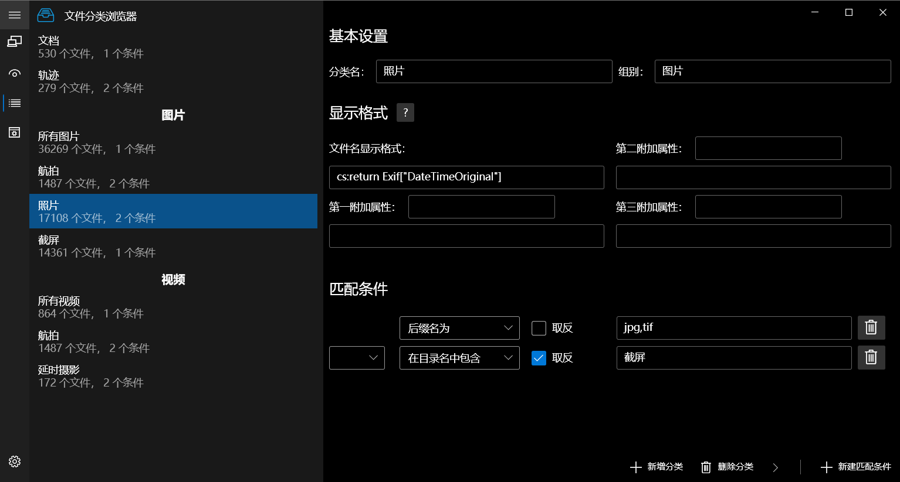

# 文件分类浏览器


## 介绍

文件分类浏览器，可以根据文件名、路径名、扩展名、文件信息等各种文件的元数据对海量文件进行自动分类并显示，也可以作为基于标签的文件管理和浏览器，进行手动分类

## 截图









## 特性

- 使用.Net Core 3.1 + WPF + SQLite+EFCore 开发
- 使用WinUI（[ModernWpfUI](https://github.com/Kinnara/ModernWpf)）风格的界面

## 如何构建

打开解决方案，设置```Classify.WPF```为启动项目，按F5一般来说可以直接运行。

如果出现依赖错误，请重新定位```Classify```和```Classify.WPF```的dll引用，dll位于项目的Libs文件夹。

## 如何使用

打开程序以后，会首先显示启动画面（这并不是为了拖时间，是后台有些初始化比较慢）。
打开之后，会默认新建一个项目。点击右上角项目设置，设置项目的名称和根目录。

然后，点击右上角分类，进入分类设置。点击右下角新建分类，
可以对分类进行命名、设置匹配策略等等。此步也可省略。

此时，直接返回浏览页面（右上角按钮），首先需要点击右下角更新文件，
点击确定后，程序将会扫描根目录下所有文件，并进行自动分类（如果有设置过）。
扫描完成后，点击左侧任意分类，即可查看该分类下的文件。
点击左下角的更多-查看全部文件，可以查看所有的文件。

也可以不使用自动分类，建立分类后，不设置匹配策略，
而是在浏览界面将文件拖入文件视图或分类项，也可点击下方添加文件添加。

其他功能还有：
- 列表、图标、平铺、树状、详细信息5个视图
- 按文件夹分组功能
- 排序功能
- 跳转到目录功能
- 右键菜单
  - 打开目录
  - 查看文件元数据
  - 快速进行重分类
  - 查看文件属性
- 拖放功能
  - 将文件拖放到分类项
  - 将外部文件拖放到文件视图进行添加
  - 将程序中的文件拖放到外部进行复制、建立快捷方式的操作
  - 拖放分类进行重排序
- 文件标题和扩展属性自定义（支持简易模式、PowerShell语法、C#语法）
- 导入导出项目/文件
- 多种缩略图显示
- 左键和中间点击分类标签进入或删除分类
- 查看全部、未分类的、被手动分类的、被手动从分类中删除的文件
- 设置
  - 亮色和暗色主题
  - 平滑滚动
  - 缩略图缓存位置

等等。其他功能不在此一一赘述。

（日后可能会出详细的使用说明书）

## 更新计划和待解决BUG

暂无

## 更新日志

[日志](ChangeLog.md)