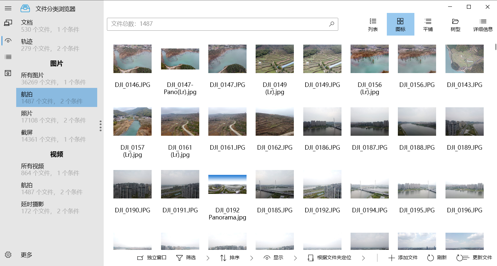

# 文件分类浏览器

## 介绍

文件分类浏览器，可以根据文件名、路径名、扩展名、文件信息等各种文件的元数据对海量文件进行自动分类并显示，也可以作为基于标签的文件管理和浏览器，进行手动分类

## 截图

## 特性

- 使用.Net Core 3.1 + WPF + SQLite+EFCore 开发
- 使用WinUI（[ModernWpfUI](https://github.com/Kinnara/ModernWpf)）风格的界面

## 更新计划和待解决BUG

增加Exif匹配条件功能

树状图排序可能有问题

为每个类增加文件名显示表达式

## 更新日志

[日志](ChangeLog.md)